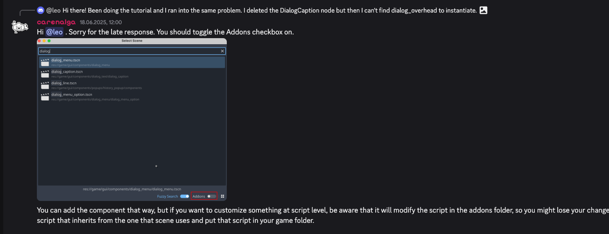
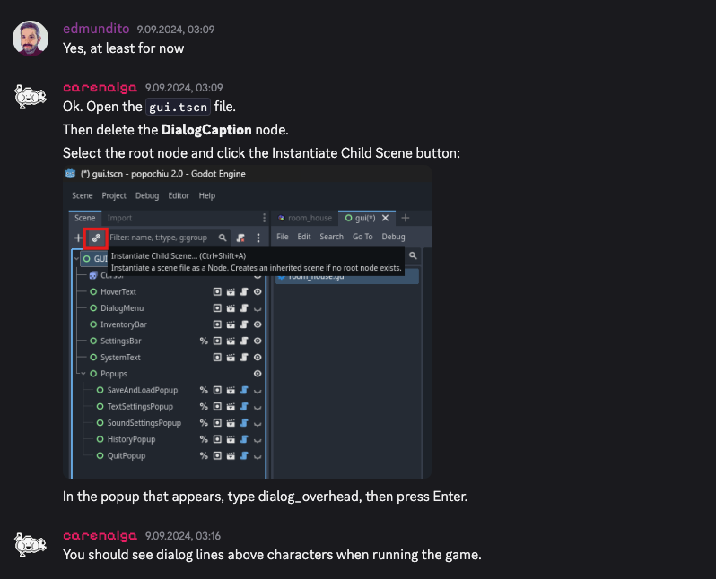
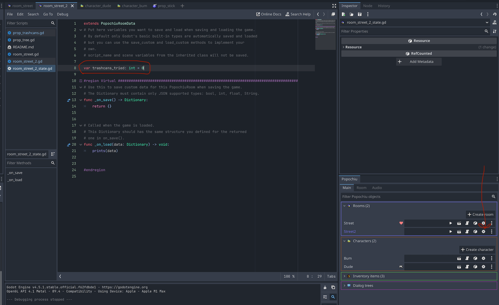
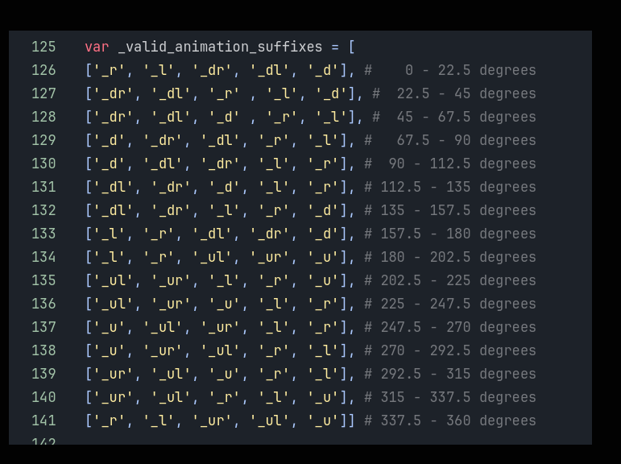

# dude-and-bum

## Stack  

[Godot 4.5](https://godotengine.org/)  
[Popoichu 2.0.3](https://github.com/carenalgas/popochiu)  

## General 

[Popoichu documentation](https://carenalgas.github.io/popochiu/)  
[Popoichu sample game](https://github.com/carenalgas/popochiu-sample-game)

[Youtube of PP Author, tutorials 1.+](https://www.youtube.com/@carenalga)   
[MAP Scroll Tutorial(and some other things to see) P v 2.0](https://www.youtube.com/watch?v=CSxynWQecDg&t=218s)  

[Animation in Asprite](https://www.youtube.com/watch?v=kzzPg1RBbl0)

## Creating characters: 

Important:

for Baseline to work correcly go to characer Node, and Move Sprite2D up so it is position that legs are above center line. 

## Dialog above characters: 

## Adding State for Save and when changing rooms

## Character Animation
### Names of direction
walk_l  
walk_r  
walk_u  
walk_d  
idle 

More directions:  

### Movement

- PP uses [NavigationRegion2D](https://docs.godotengine.org/en/stable/classes/class_navigationregion2d.html)
